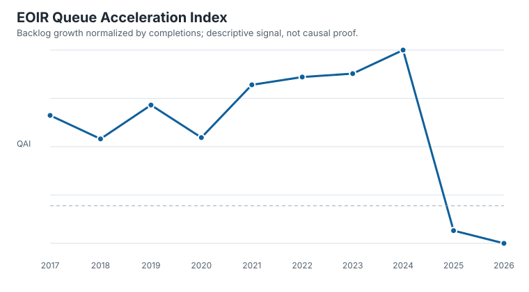

# Open Institutional Capacity Observatory

Institutions increasingly review, contest, and oversee decisions at a scale that may outgrow their observable administrative capacity. OICO is open research software for measuring traces of that pressure from reproducible public data.

OICO is built around one careful question: when decision volume grows faster than recorded throughput, what can researchers observe, measure, and reproduce without pretending that a proxy is the institution itself?

## Flagship Case

The first reproducible case studies annual workload observations from the U.S. Executive Office for Immigration Review. In the frozen snapshot, pending matters rose from 826,488 in 2016 to a peak of 3,925,351 in 2024. The Queue Acceleration Index (QAI) was positive in all eight comparable annual periods from 2017 through 2024 and reached 1.580 in 2024. This is evidence of backlog growth relative to recorded completions in the snapshot. It is not evidence of staffing failure, causality, legal noncompliance, or institutional intent.



Reproduce the case study from a clean checkout with:

```bash
python -m pip install -e .
oico reproduce
python -m unittest discover -s tests
```

The exact inputs, transformations, output table, figure, interpretation, and limitations are in [the flagship case study](docs/FLAGSHIP_CASE_STUDY.md). The one-command workflow writes a machine-readable report to `examples/flagship/outputs/flagship_report.json`.

## What OICO Measures

| Component | Status | Defensible use |
|---|---|---|
| QAI | Stable | Descriptive backlog growth normalized by recorded completions. |
| ASI | Beta | Exploratory coding of accountability specificity in a small document corpus. |
| SEDI | Experimental | Theory-led index of observable degradation signals. |
| Authorization Saturation | Experimental | Illustrative queueing scenarios, not calibrated institutional estimates. |
| Procedural Capacity | Experimental | Transparent risk scenarios for review, contestation, and accountability constraints. |

The status hierarchy is intentional. OICO does not promote a formal model to an empirical measure merely because it is mathematically convenient. See [metric status and boundaries](docs/METRIC_STATUS.md).

## Data and Reproducibility

The release uses frozen source snapshots and derived metadata for EOIR, USCIS, CFPB, SEC, and an accountability-document corpus. Each source has a provenance record, checksum, transformation note, and redistribution decision in [the source register](datasets/metadata/source_register.csv) and [the license review](datasets/metadata/license_review.md). The data package does not redistribute linked third-party policy documents.

The reproducibility contract is documented in [REPRODUCIBILITY.md](docs/REPRODUCIBILITY.md). Start with the [three-command reproduction page](https://silvercoin256.github.io/open-institutional-capacity-observatory/reproduce/), then use [REPLICATION.md](REPLICATION.md) and report a result through the [independent reproduction issue form](https://github.com/SilverCoin256/open-institutional-capacity-observatory/issues/new?template=independent-reproduction.yml). Researchers are also invited to [Break OICO](BREAK_OICO.md) with substantive criticism.

## Research Software

```text
oico/                  Python package, CLI, metrics, models, validation
datasets/              Frozen inputs, derived tables, schemas, manifests
examples/flagship/     Canonical EOIR analysis and machine-readable outputs
benchmarks/            Baseline tasks with explicit proxy-label caveats
figures/               Deterministic SVG figures and manifest
docs/                  Methods, audits, tutorials, adoption, and release notes
notebooks/             Executable walkthroughs
website/               Static research site
tests/                 Unit, data, integration, and reproduction tests
community/             Contribution, governance, and researcher onboarding
```

## Install and Extend

OICO requires Python 3.10 or newer and has no runtime dependencies. The public API currently exposes `oico.queue_acceleration_index`; the CLI provides data building, validation, figures, benchmarks, the flagship case, reproduction, and release auditing. Contributions should add provenance, tests, assumptions, limitations, and a clear expected misuse statement.

## Scientific Boundaries

OICO is descriptive and diagnostic unless a future study supplies stronger identification. Public traces are incomplete observations of institutional processes. QAI is close to normalized backlog change; ASI measures document language rather than operational accountability; SEDI and the two formal models remain experimental until externally calibrated. No module alone measures institutional quality, human effort, intent, legal compliance, or causal AI impact.

## Citation and License

Cite the release using [CITATION.cff](CITATION.cff). No DOI is claimed until a real archival record is published. Code is MIT-licensed. Dataset metadata and derived documentation are CC BY 4.0 where stated; underlying sources retain their original terms. See [AI usage disclosure](AI_USAGE.md), [design decisions](docs/DESIGN_DECISIONS.md), [external-validation status](docs/EXTERNAL_VALIDATION.md), and the [Zenodo deposit metadata](.zenodo.json).

Project site: <https://silvercoin256.github.io/open-institutional-capacity-observatory/>

Repository: <https://github.com/SilverCoin256/open-institutional-capacity-observatory>
